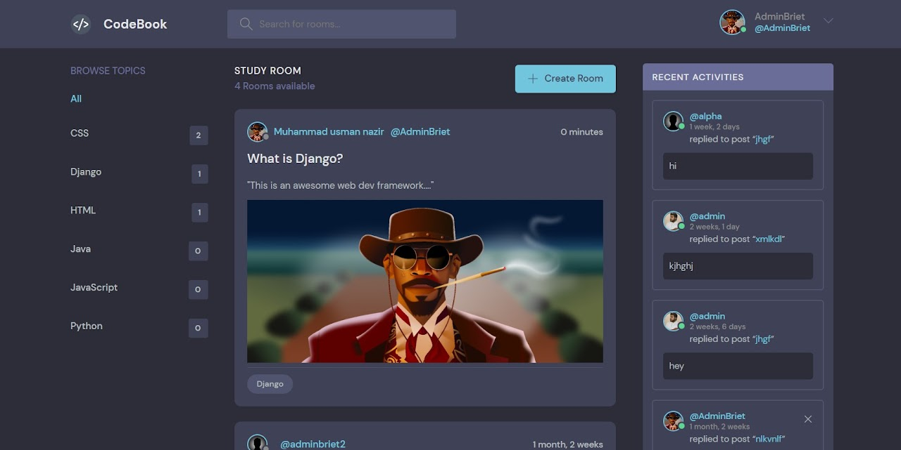

<h1 align="center">CODEBOOK</h1>
<a href="#">
  <div align="center">
    
  </div>
</a> 


## Usage

Installing requirements and dependencies
```
git clone https://github.com/ocman-nazir-briet/codebook-final4.git
cd codebook-final4
pip install -r requirements.txt
```

Running the server
```
python manage.py runserver
```
Opening the Server
```
127.0.0.1:8000
```
## Author
#### Ocman Nazir Briet
You can contact or connect with me.

[](https://twitter.com/ocmannazirbriet)
[](https://www.linkedin.com/in/ocman-nazir-briet/)

## 👋 If you need some advices or mentorship

Before coding, one of my passion is connecting with people. That's why I regularly offer 1-2 hours of mentorship for whoever needs some advices and guidance.
Don't be surprised, it's just what I love doing!


## LICENSE
- MIT (2023)
